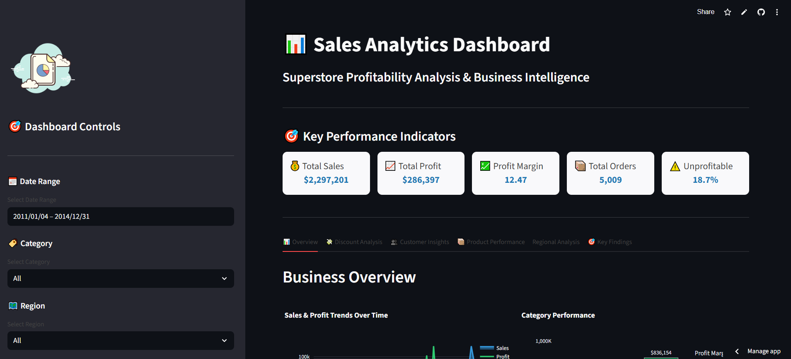

# 📊 Sales Analytics Dashboard - Superstore Dataset

> 🚀 **[VIEW LIVE DASHBOARD →](https://supserstore-dashboard.streamlit.app/)**

> An interactive sales analytics dashboard that identified **$458,307 in annual profit recovery opportunities** through advanced data analysis, revealing critical discount policy flaws and customer lifecycle patterns.

---

## 📸 Dashboard Preview

*Interactive dashboard with real-time filtering and 6 analytical sections*

### Key Features Showcase

<table>
  <tr>
    <td width="50%">
      
      
<b>The Profit Cliff</b> 97% failure rate at 25%+ discounts

    </td>
    <td width="50%">
      
      
<b>Customer Value Pyramid</b> Top 20% generate 60%+ of profit

    </td>
  </tr>
  <tr>
    <td width="50%">
      
      
<b>Regional Performance</b> Category × Region profitability matrix

    </td>
    <td width="50%">
      
      
<b>Executive Summary</b> 5 critical insights with ROI projections

    </td>
  </tr>
</table>
